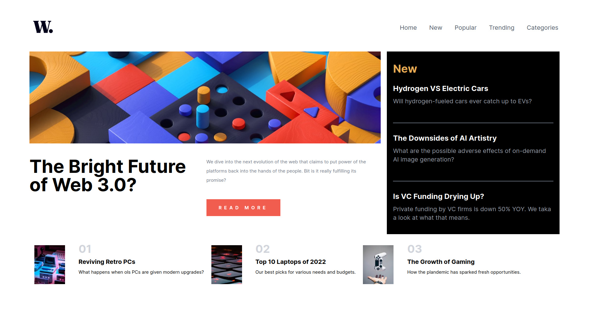

# Frontend Mentor - News homepage solution

This is a solution to the [News homepage challenge on Frontend Mentor](https://www.frontendmentor.io/challenges/news-homepage-H6SWTa1MFl). Frontend Mentor challenges help you improve your coding skills by building realistic projects.

## Table of contents

- [Overview](#overview)
  - [The challenge](#the-challenge)
  - [Screenshot](#screenshot)
  - [Links](#links)
- [My process](#my-process)
  - [Built with](#built-with)
  - [What I learned](#what-i-learned)
  - [Continued development](#continued-development)
  - [Useful resources](#useful-resources)
- [Author](#author)
- [Acknowledgments](#acknowledgments)

**Note: Delete this note and update the table of contents based on what sections you keep.**

## Overview

### The challenge

Users should be able to:

- View the optimal layout for the interface depending on their device's screen size
- See hover and focus states for all interactive elements on the page

### Screenshot



### Links

- Solution URL: [Add solution URL here](https://github.com/ttsoares/news-homepage)
- Live Site URL: [Add live site URL here](https://news-homepage-phi-ashen.vercel.app/)

## My process

### Built with

- Flexbox
- CSS Grid
- [React](https://reactjs.org/) - JS library
- [Next.js](https://nextjs.org/) - React framework
- [react-burger-menu](https://www.npmjs.com/package/react-burger-menu) - Library to facilitate burger menus

### What I learned

Better understanding about grids with Tailwind

To see how you can add code snippets, see below:

```jsx
<main className="flex flex-col md:grid grid-cols-1 grid-rows-8 md:grid-cols-3 gap-5  w-full h-fit">
  <div className="order-1 w-full h-[300px] md:row-span-2 col-span-1 md:col-span-2 bg-img-top-mob md:bg-img-top-dsk bg-cover bg-no-repeat"></div>
```

### Continued development

Each opportunity the deal with Tailwind new details emerge...

## Useful resources

- [Burger Menu](https://www.npmjs.com/package/react-burger-menu) - Tool to facilitate creation of burger-menus.

## Author

- Website - [Thomas Tschoepke Soares](https://www.linkedin.com/in/thomas-soares-6791781b/)
- Frontend Mentor - [@ttsoares](https://www.frontendmentor.io/profile/ttsoares)

## Acknowledgments

I did this challenge several weeks ago but was too ashamed of the code to post it...
Now after several projects I'm less ashamed.
